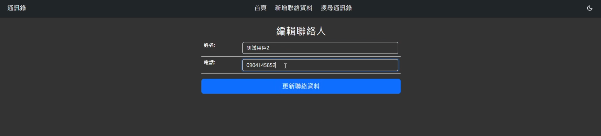

# 資料庫程式設計期末專題 - 通訊錄管理系統

這是一個為資料庫程式設計課程期末專題所製作的簡單的通訊錄管理系統。

## 功能特色

1. **聯絡人管理**：使用者可以新增、編輯、刪除和搜尋聯絡人。

   - 新增聯絡人：透過 [`functions/add.php`](functions/add.php) 進行處理。
   - 編輯聯絡人：透過 [`functions/edit.php`](functions/edit.php) 進行處理。
   - 搜尋聯絡人：透過 [`functions/search.php`](functions/search.php) 進行處理。
   - 刪除聯絡人：透過 [`index.php`](index.php) 進行處理。
2. **分頁功能**：在主頁面顯示聯絡人列表，並提供分頁功能。當頁碼過多時，會顯示 `...`，點擊後會顯示輸入框，使用者可以直接輸入頁碼進行跳轉。
3. **主題切換**：使用者可以切換網站的主題（亮色和暗色）。

## 安裝與使用

1. 下載專案的壓縮檔或使用 Git Clone。
2. 在終端機中進入專案資料夾。
3. 修改 [`includes/db.php`](includes/db.php)，將資料庫設定改為您自己的設定。
4. 使用 XAMPP 或 AppServ 啟動 Apache 和 MySQL 並把檔案放入。
5. 建立以下資料表：

```sql
CREATE DATABASE address_book;

USE address_book;

CREATE TABLE contact (
    id INT AUTO_INCREMENT PRIMARY KEY,
    name VARCHAR(255) NOT NULL,
    tel VARCHAR(255) NOT NULL
);
```

6. 確認所有設定都已完成後，即可開始使用此專案。

## 技術堆疊

- PHP：用於處理後端邏輯，如聯絡人管理。
- JavaScript：用於處理前端邏輯，如主題切換和分頁功能。
- CSS：用於頁面的樣式設計。
- Bootstrap 5：用於快速設計和自定義響應式網站。

## 網站預覽 (Website Preview)

### 通訊錄系統

- **通訊錄主頁面 (暗色主題)**
  

- **通訊錄主頁面 (亮色主題)**
  

- **新增聯絡人頁面**
  

- **編輯聯絡人頁面**
  

- **搜尋聯絡人頁面**
  

### 分頁系統

- **分頁按鈕 (預設狀態)**
  
- **分頁輸入框 (點擊 ... 編輯)**
  
- **分頁按鈕 (成功切換)**
  
